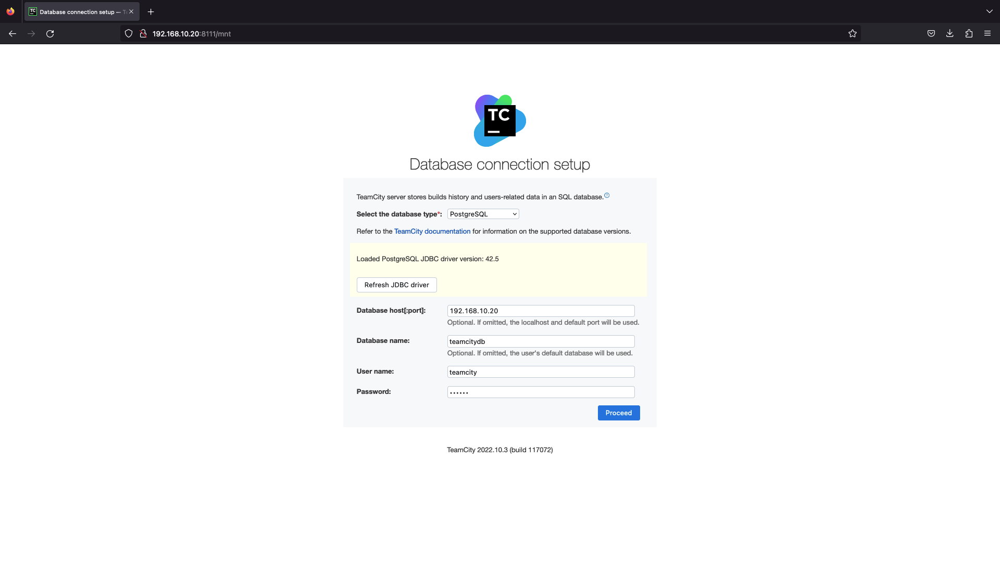

# TeamCity Setup

## Description

This project is intended to simplify deployment of TeamCity, including
infrastructure provisioning, required workloads deployment and some basic
configuration of TeamCity itself.

## Table of contents

- [Prerequisites](#prerequisites)
- [Infrastructure provisioning](#infrastructure-provisioning)
- [Workloads deployment](#workloads-deployment)
- [TeamCity configuration](#teamcity-configuration)

# Prerequisites

- Terraform v1.4+
- Helm v3.12+

## Infrastructure provisioning

Project contains Terraform module, named `teamcity-setup`, which provisions
whole underlying infrastructure, required for TeamCity. The main things it
creates by default:

- VPC with several public and private subnets, route tables and required
  gateways
- EKS cluster itself, along with two node pools for servers and agents
  accordingly
- Necessary IAM roles
- S3 bucket for storing artifacts
- Multi-AZ RDS instance
- DNS zone

To create resources using this module, do the following (for example, you may do
that in the `terraform/` directory. NOTE: don't forget to configure AWS
provider):

```shell
# Create a main.tf file with the following contents (change something if needed) 
cat > main.tf <<EOF
provider "aws" {
  region = "eu-central-1"
}

module "teamcity" {
  source = "./modules/teamcity-setup"

  vpc_network = {
    primary_cidr_range   = "192.168.0.0/16"
    availability_zones   = ["a", "b"]
  }

  create_dns_zone = true
  dns_zone_name   = "example.com"
}
EOF

# Init terraform
terraform init

# Run a plan
terraform plan

# If plan looks ok, we may apply init
terraform apply

# Wait for the infrastructure to be provisioned, it may take some time. 
# Note the outputs, we will need them later
```

Following inputs are supported:

| Variable                              | Description                                                  |           Required            | Default                                   |
|---------------------------------------|--------------------------------------------------------------|:-----------------------------:|-------------------------------------------|
| `vpc_network.primary_cidr_range`      | Primary network CIDR range                                   |              yes              |                                           |
| `vpc_network.secondary_cidr_range`    | Secondary network CIDR range                                 | no<sup>[1](#footNote1)</sup>  | ""                                        |
| `vpc_network.availability_zones`      | List of availability zones letters (e.g. `a`, `b` and so on) |              no               | All available zones for the chosen region |
| `cluster_name`                        | Name of the cluster to create                                |              no               | "tc-eks-cluster"                          |
| `cluster_version`                     | K8s version of the cluster to create                         |              no               | "1.26"                                    |
| `enable_vpc_native_networking`        | Whether to use VPC native networking or not                  |              no               | false                                     |
| `server_scaling_config.desired_nodes` | Desired nodes for servers nodepool                           |              no               | 1                                         |
| `server_scaling_config.min_nodes`     | Min nodes for servers nodepool                               |              no               | 1                                         |
| `server_scaling_config.max_nodes`     | Max nodes for servers nodepool                               |              no               | 1                                         |
| `agents_scaling_config.desired_nodes` | Desired nodes for agents nodepool                            |              no               | 1                                         |
| `agents_scaling_config.min_nodes`     | Min nodes for agents nodepool                                |              no               | 1                                         |
| `agents_scaling_config.max_nodes`     | Max nodes for agents nodepool                                |              no               | 1                                         |
| `server_capacity_type`                | One of SPOT, ON_DEMAND                                       |              no               | "ON_DEMAND"                               |
| `agents_capacity_type`                | One of SPOT, ON_DEMAND                                       |              no               | "ON_DEMAND"                               |
| `server_machine_types`                | Instance type for servers nodepool                           |              no               | "c5.xlarge"                               |
| `agents_machine_types`                | Instance type for agents nodepool                            |              no               | "c5.xlarge"                               |
| `cluster_iam_role`                    | User provided cluster IAM role                               |              no               | ""                                        |
| `node_iam_role`                       | User provided node IAM role                                  |              no               | ""                                        |
| `cluster_iam_role_policies`           | Additional cluster IAM role policies                         |              no               | []                                        |
| `node_iam_role_policies`              | Additional node IAM role policies                            |              no               | []                                        |
| `artifacts_bucket_name`               | Name for S3 bucket, which will be created                    |              no               | "teamcity-artifacts"                      |
| `database_name`                       | TeamCity server database name                                |              no               | "teamcity"                                |
| `database_machine_type`               | TeamCity server database machine type                        |              no               | "db.r5b.xlarge"                           |
| `database_size`                       | TeamCity server database size (GiB)                          |              no               | 5                                         |
| `database_engine`                     | TeamCity server database engine                              |              no               | "postgres"                                |
| `database_user`                       | TeamCity server database user                                |              no               | "teamcity"                                |
| `database_password`                   | TeamCity server database password                            | no <sup>[2](#footNote2)</sup> | ""                                        |
| `create_dns_zone`                     | Whether to create Route 53 hosted DNS zone or not            |              no               | false                                     |
| `dns_zone_name`                       | Name of DNS zone to create                                   |              no               | ""                                        |

<a name="footNote1">1</a>: Required if `enable_vpc_native_networking` is enabled

<a name="footNote2">2</a>: If you don't provide a password, it would be
automatically generated

Following outputs are exported:

| Output             | Description                     |
|--------------------|---------------------------------|
| `cluster.endpoint` | Endpoint of created EKS cluster |
| `rds.hostname`     | Endpoint of created DB instance |
| `rds.port`         | Port of created DB instance     |
| `rds.username`     | Username for created DB         |
| `rds.database`     | Name of created DB              |
| `s3.bucket`        | Name of created S3 bucket       |

## Workloads deployment

All necessary workloads are deployed using Helm chart, which is under `helm/`
folder of this project. It installs the following components:

- TeamCity and all its additional resources
- AWS Load Balancer Controller (would automatically create load balancers for
  Ingress resources)
- External DNS (would update DNS records in DNS zone, created by Terraform,
  according to Ingress resources)
- Karpenter (basically a cluster autoscaler)

The following command will install chart into cluster (make sure you have
Kubernetes context configured):

```shell
# cd to chart directory and run
helm upgrade "teamcity-stack" . -f values.yaml --install --wait
```

Following settings are supported:

| Variable                                | Description                                                                                 | Required | Default                   |
|-----------------------------------------|---------------------------------------------------------------------------------------------|:--------:|---------------------------|
| `teamcity.nameOverride`                 | Override release name                                                                       |    no    | `.Chart.Name`             |
| `teamcity.imagePullSecrets`             | Secret name(s), which should be used to pull teamcity components images                     |    no    | []                        |
| `teamcity.server.replicas`              | Number of desired replicas for server deployment<sup>[3](#footNote3)</sup>                  |    no    | 1                         |
| `teamcity.server.image.name`            | TC server Docker image                                                                      |    no    | jetbrains/teamcity-server |
| `teamcity.server.image.tag`             | TC server Docker image tag                                                                  |    no    | latest                    |
| `teamcity.server.env`                   | Additional environment variables to pass to TC server container                             |    no    | []                        |
| `teamcity.server.args`                  | Additional cli args to pass to TC server container                                          |    no    | []                        |
| `teamcity.server.serviceAccount.create` | Whether to create service account for TC server deployment or not<sup>[4](#footNote4)</sup> |    no    | true                      |
| `teamcity.server.resources.cpu`         | TC server cpu requests                                                                      |    no    | 2                         |
| `teamcity.server.resources.memory`      | TC server memory requests                                                                   |    no    | 4Gi                       |
| `teamcity.server.pvc.provisioner`       | Persistent storage provisioner                                                              |    no    | kubernetes.io/aws-ebs     |
| `teamcity.server.pvc.size`              | Persistent storage size                                                                     |    no    | 50Gi                      |
| `teamcity.server.pvc.type`              | Persistent storage type                                                                     |    no    | gp3                       |
| `teamcity.server.service.port`          | Which port to expose by service                                                             |    no    | 8111                      |
| `teamcity.server.ingress.enabled`       | Whether to create ingress or not                                                            |    no    | true                      |
| `teamcity.server.ingress.host`          | TC server public hostname                                                                   |    no    | ""                        |
| `teamcity.server.ingress.class`         | IngressClass name                                                                           |    no    | alb                       |
| `teamcity.server.ingress.tlsSecretName` | Name of secret, containing TLS cert                                                         |    no    | ""                        |
| `teamcity.server.ingress.annotations`   | Ingress annotations                                                                         |    no    | {}                        |
| `teamcity.server.nodeSelector`          | Additional server nodeSelector labels                                                       |    no    | {}                        |
| `teamcity.agent.image`                  | TC agent Docker image                                                                       |    no    | jetbrains/teamcity-agent  |
| `teamcity.agent.tag`                    | TC agent Docker image tag                                                                   |    no    | latest                    |
| `teamcity.agent.env`                    | Additional environment variables to pass to TC agent container                              |    no    | []                        |
| `teamcity.agent.args`                   | Additional cli args to pass to TC agent container                                           |    no    | []                        |
| `teamcity.agent.resources.cpu`          | TC agent cpu requests                                                                       |    no    | 2                         |
| `teamcity.agent.resources.memory`       | TC agent memory requests                                                                    |    no    | 4Gi                       |
| `teamcity.agent.nodeSelector`           | Additional agent nodeSelector labels                                                        |    no    | {}                        |
| `teamcity.agent.dockerInDocker.enabled` | Whether to enable docker in docker for agent or not                                         |    no    | false                     |

Also each of dependent charts may be configured via corresponding keys:

| Key                            | Configuration                                                                             |
|--------------------------------|-------------------------------------------------------------------------------------------|
| `aws-load-balancer-controller` | https://kubernetes-sigs.github.io/aws-load-balancer-controller/v2.2/deploy/configurations |
| `external-dns`                 | https://github.com/kubernetes-sigs/external-dns/blob/master/docs/tutorials/aws.md         |
| `karpenter`                    | https://karpenter.sh/v0.27.3/getting-started/getting-started-with-karpenter               |

<a name="footNote3">3</a>: Use this setting only if you're sure, that you need
it. In most cases the number of replicas should be 1

<a name="footNote4">4</a>: If you're planning to use `Default Service Account`
authentication scheme in TC `Cloud Profile`, this must be true

## TeamCity configuration

In the final part of setup we need to configure TeamCity itself. It's pretty
easy to do, thanks
to [Kotlin DSL](https://www.jetbrains.com/help/teamcity/kotlin-dsl.html).
In order to configure TeamCity, just follow these steps:

1. Open TeamCity UI (It would be some DNS hostname, if you have provided it to
   Terraform or just instance public IP), press procees
   
2. Connect to database (here you should use database endpoint output from
   Terraform. If you haven't provided any database password, you'll need to dive
   a bit deeper and take it from TF state :))
   
3. TeamCity will ask you to create administrator account, proceed with it
4. After you've done that, you'll see the start page of TeamCity. Now we can
   finally start configuring it for our needs. Navigate to `<Root project>`'s
   VCS settings (`Administration -> <Root project> -> VCS Roots`) and connect
   TeamCity to this repository
   
5. When connection is established, navigate to `Versioned Settings` tab and
   enable synchronization. You'll see a window, which offers you to import
   settings from VCS
   
6. You'll see an error occurs, while importing settings, which would say
   something
   like `TeamCity wasn't able to find secure values for some of the tokens`.
   This error is caused by the fact that settings reference several secrets by
   autogenerated value `token`,
   which are absent in our new installation. So you need to click on the error
   and provide required secrets. They are password/token for docker registry (if
   you need it) and password/token for SampleGoProject VCS
   
7. After you've provided required values, settings from VCS should be applied to
   TeamCity and you should see project structure like that
   
8. Sample project has the following build steps by default
   
9. Let's run several sample builds
   
10. As you can see, they've all finished successfully, that means that our Go
    app was tested (if it had tests :)), packaged into Docker image and pushed
    to DockerHub. Here it is

11. It even works

